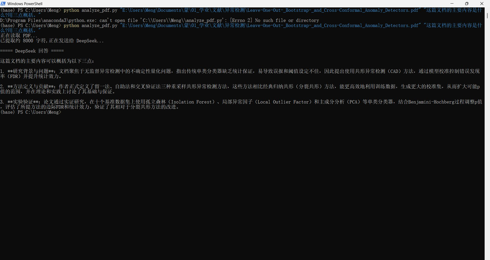
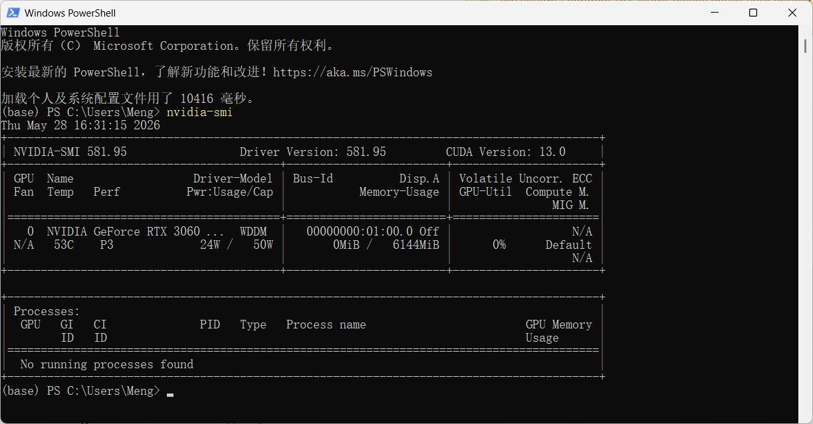
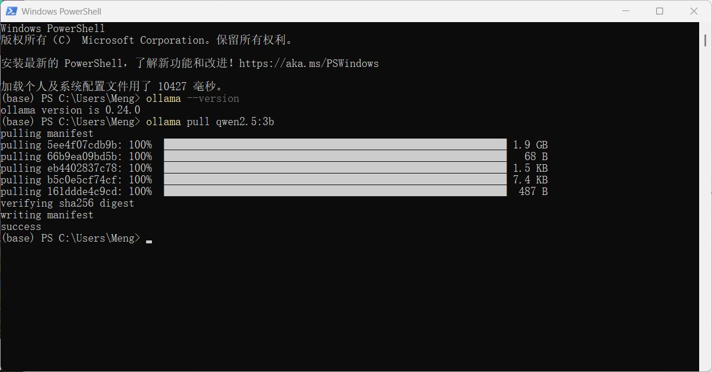
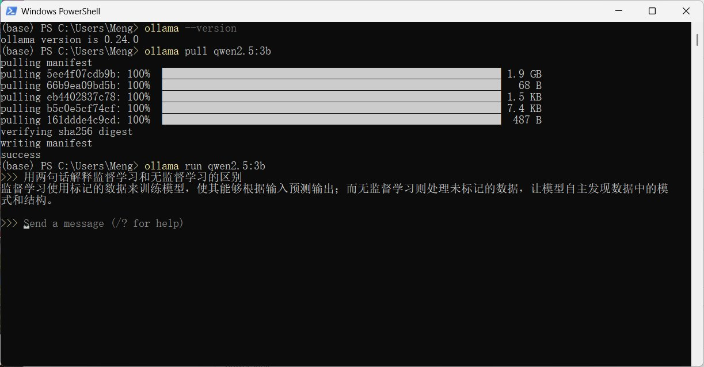
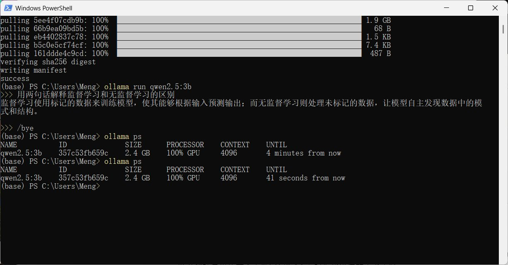
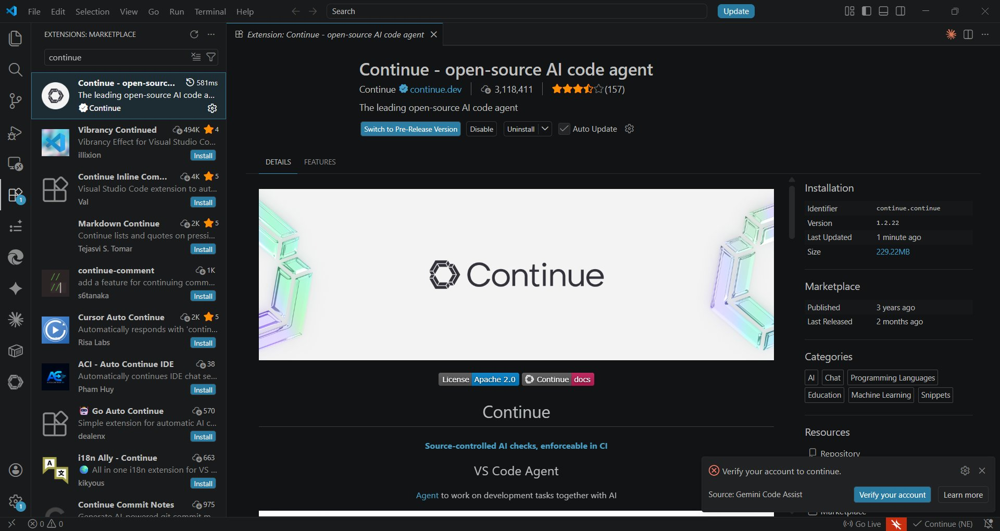
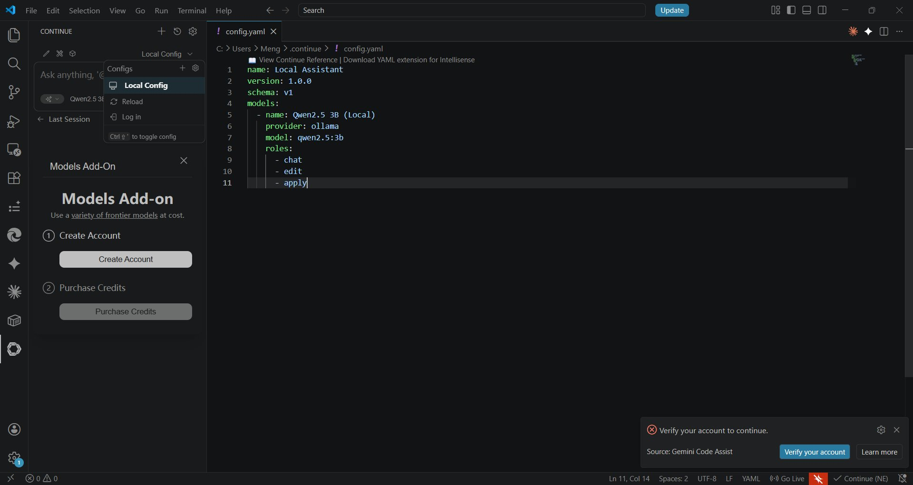
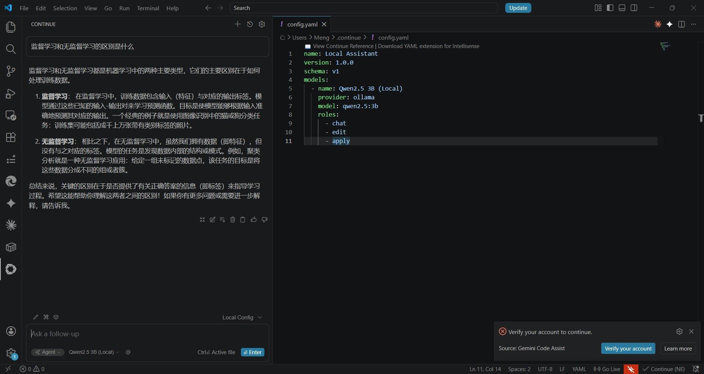
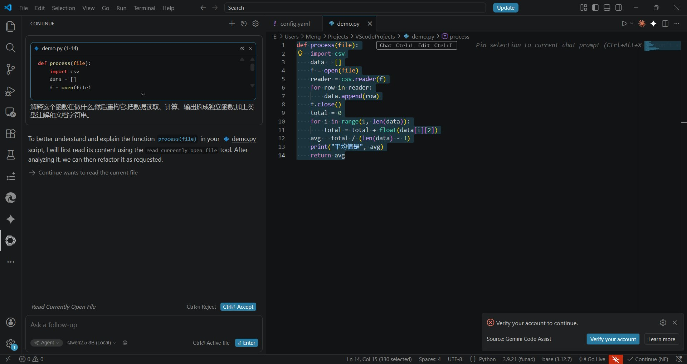

# Assignment 3: Deployment and Integration of AI Agents

**Name:** Wang Meng
**Course:** Remote Development
**Environment:** Windows 11 + NVIDIA RTX 3060 (6GB) + Anaconda Python

---

## Overview

This report documents my full process of completing Assignment 3, covering three deployment tasks and a reflection. The three tasks are: building an online agent that analyzes a file using the DeepSeek API, deploying a local open-source model with Ollama, and integrating the local model into VSCode through the Continue extension. Below I record each step, the problems I ran into, and how I solved them, in the order I actually worked.

My actual execution order was **Part 2 (local model) → Part 3 (IDE integration) → Part 1 (online agent)**, because the first two steps do not depend on a paid external API — I wanted to get everything that could be done locally working first, and handle the part requiring an API key last. For readability, this report is organized following the assignment's task numbering.

---

## Part 1: Online Agent — File Analysis with the DeepSeek API

### Approach

The assignment asks me to call an online LLM's API to do something "beyond simple chatting" — either web search or file analysis. I chose **file analysis**: a Python script that reads a PDF paper, sends its content to DeepSeek, and asks it a question about the paper. I did not use a no-code platform like Dify or Coze; instead I wrote the script directly, because I wanted to understand the structure of the API call itself, and this is closer to the real intent of "integrating the model into a program as a tool."

### Steps

**1. Set up the environment.** Install dependencies:

```powershell
pip install openai pdfplumber
```

DeepSeek provides an OpenAI-compatible interface, so I can use the `openai` library directly and only need to change the `base_url`.

**2. Obtain an API key.** I registered and created an API key on the [DeepSeek platform](https://platform.deepseek.com/). For security, the key is not hard-coded in the script; it is read from the environment variable `DEEPSEEK_API_KEY`.

**3. Write the script** `analyze_pdf.py`:

```python
import sys
import os
import pdfplumber
from openai import OpenAI

def extract_pdf_text(path, max_chars=8000):
    """Read PDF text, truncated to max_chars to avoid exceeding the context window."""
    text = ""
    with pdfplumber.open(path) as pdf:
        for page in pdf.pages:
            page_text = page.extract_text()
            if page_text:
                text += page_text + "\n"
    if not text.strip():
        raise ValueError("The PDF has no extractable text layer (it may be a scan and need OCR).")
    return text[:max_chars]

def main():
    if len(sys.argv) < 3:
        print('Usage: python analyze_pdf.py "PDF_path" "your question"')
        return

    pdf_path = sys.argv[1]
    question = sys.argv[2]

    api_key = os.environ.get("DEEPSEEK_API_KEY")
    if not api_key:
        print("Error: environment variable DEEPSEEK_API_KEY not found")
        return

    if not os.path.exists(pdf_path):
        print(f"Error: file not found {pdf_path}")
        return

    print("Reading PDF...")
    pdf_text = extract_pdf_text(pdf_path)
    print(f"Extracted about {len(pdf_text)} characters, sending to DeepSeek...\n")

    client = OpenAI(api_key=api_key, base_url="https://api.deepseek.com")

    try:
        response = client.chat.completions.create(
            model="deepseek-chat",
            messages=[
                {"role": "system", "content": "You are a rigorous research assistant. Answer questions based on the document content provided by the user."},
                {"role": "user", "content": f"Here is the content of a document:\n\n{pdf_text}\n\nQuestion: {question}"}
            ]
        )
        print("===== DeepSeek Answer =====\n")
        print(response.choices[0].message.content)
    except Exception as e:
        print(f"API call error: {e}")

if __name__ == "__main__":
    main()
```

**4. Run it.** The test PDF I used is a paper on Conformal Anomaly Detection, which happens to relate to the unsupervised anomaly detection topic of my undergraduate thesis:

```powershell
$env:DEEPSEEK_API_KEY="<my key>"
python analyze_pdf.py "E:\...\Leave-One-Out_Bootstrap_and_Cross-Conformal_Anomaly_Detectors.pdf" "What is the main content of this document? Summarize it in three points."
```

### Result



DeepSeek accurately summarized the paper in three points: the research background (addressing uncertainty quantification in unsupervised anomaly detection, proposing Conformal Anomaly Detection (CAD) to control the false discovery rate, FDR), the methodological contribution (leave-one-out, bootstrap, and cross-conformal resampling methods that use training data more efficiently than classic split conformal), and the empirical validation (across ten benchmark datasets using one-class classifiers such as Isolation Forest, LOF, and PCA, combined with the Benjamini-Hochberg procedure to evaluate FDR and statistical power). The summary quality was high and captured the core of the paper.

### Problems Encountered

On the first run it reported `can't open file ... analyze_pdf.py: No such file or directory`. The cause was a mismatch between my current directory and where the script was actually saved when I created it with `notepad`, so `python` could not find the file. After confirming the file location with `dir analyze_pdf.py`, I recreated it in the correct directory and the problem was solved.

Another minor issue: the PDF path in the command line accidentally used doubled quotes `""..."`, which broke path parsing. Changing it to single double-quotes fixed it.

---

## Part 2: Local Model Deployment — Ollama + Qwen2.5

### Environment Check

First I confirmed the GPU and driver. Running `nvidia-smi` in PowerShell:



The output shows an RTX 3060, driver 581.95, CUDA 13.0, with 6GB of VRAM. **There is a key constraint here: my 3060 is the 6GB-VRAM version.** The Q4 quantization of Qwen2.5 7B takes about 5GB, which is tight to fit into 6GB — a long context could overflow into system memory and slow things down. So I decided to first deploy the smaller, more stable **Qwen2.5 3B** (about 2GB) to make sure it fits entirely in VRAM and runs smoothly.

### Steps

**1. Install Ollama:**

```powershell
winget install Ollama.Ollama
```

After installation I closed and reopened PowerShell (to refresh PATH) and verified with `ollama --version`, which showed version 0.24.0.

**2. Pull the model:**

```powershell
ollama pull qwen2.5:3b
```



The download went smoothly, ending with `success`.

**3. Terminal interaction.** Run it directly to chat:

```powershell
ollama run qwen2.5:3b
```



I asked it to "explain the difference between supervised and unsupervised learning in two sentences," and the model gave an accurate, concise answer.

**4. Verify GPU acceleration.** I cared a lot about this step, because if Ollama did not use the GPU and fell back to CPU, it would be much slower. In a separate window I ran `ollama ps`:



The `PROCESSOR` column shows **100% GPU**, confirming the 3060 was doing the work throughout and that GPU acceleration was active.

### Problems Encountered

My main concern was insufficient VRAM, which is why I chose 3B instead of 7B (see the environment check above). In practice the 3B model responded quickly (2–3 seconds) with no lag at all, which is more than enough for a demo and for everyday coding assistance. With 7B, I expect I would need to reduce the context length to run stably within 6GB of VRAM.

---

## Part 3: IDE Integration — VSCode + Continue with the Local Model

### Steps

**1. Install the Continue extension.** I first tried installing from the command line:

```powershell
code --install-extension Continue.continue
```

But it failed with `Client network socket disconnected before secure TLS connection was established` — the TLS connection was interrupted, a network/proxy problem (the command-line request did not go through the proxy). Installing through the **VSCode GUI** worked instead: search "Continue" in the extensions panel, pick the one published by Continue.dev, and click Install.



**2. Configure it to point to the local Ollama.** By default Continue pushes you toward cloud paid models, so I had to manually edit the config to use the local model. Edit `C:\Users\Meng\.continue\config.yaml`:

```yaml
name: Local Assistant
version: 1.0.0
schema: v1
models:
  - name: Qwen2.5 3B (Local)
    provider: ollama
    model: qwen2.5:3b
    roles:
      - chat
      - edit
      - apply
```



After saving and reloading, "Qwen2.5 3B (Local)" appeared in the model selector, and I selected it.



### Demo: Code Explanation and Refactoring

I created a `demo.py` containing a deliberately messy function (mixing CSV reading, averaging, and printing together, with no type annotations or docstring). I selected the code, pressed `Ctrl+L` to send it to Continue, and asked it to "explain what this function does, then refactor it: split data reading, calculation, and output into separate functions, and add type annotations and docstrings."



The local model first accurately explained the logic of the original function, then split the code into three independent functions: `read_data` (read the CSV), `calculate_average` (average the third column), and `process` (tie them together), and added type annotations and docstrings.

**My own observation (not blindly accepting the AI output):** in the refactored `calculate_average`, it added a defensive check `if len(item) > 2` that the original code did not have, which is a reasonable robustness improvement. However, it also kept the somewhat questionable divisor `len(data) - 1` from the original code unchanged — the original function was probably trying to skip a header row, but this is actually ambiguous (if the data has no header row, the result would be off). This shows that a small local model can do sensible structural refactoring, but it does not question this kind of implicit business logic, so a human still needs to review the output.

---

## Part 4: Documentation and Reflection

### Summary of Completion

| Task | Tools Used | Status |
|---|---|---|
| Online agent (file analysis) | DeepSeek API + pdfplumber + Python | Done |
| Local model deployment | Ollama + Qwen2.5 3B | Done |
| IDE integration | Continue (VSCode) + local model | Done |
| GPU acceleration check | ollama ps (100% GPU) | Done |

### Online vs. Local Model Comparison

**Answer quality:** DeepSeek (online) is clearly stronger. On a task like summarizing a whole paper, which needs long-context understanding and domain knowledge, its three-point summary was accurate and well-organized. The local Qwen2.5 3B is good enough for short tasks (code refactoring, simple Q&A), but being a small model, its ability is limited on complex, long-text tasks.

**Speed:** For short prompts, the local model is actually faster, since there is no network latency — the 3B model responds in just 2–3 seconds. But for long outputs, online DeepSeek is faster in practice, since my 3060 is only an entry-level GPU.

**Ease of use:** DeepSeek's OpenAI-compatible interface was very easy to integrate — a few lines of code and it works. Ollama is also simple: one `winget` command to install, one `pull` to get the model. Ironically it was Continue's installation that gave me trouble, due to the network issue.

**Privacy and cost:** the local model has a clear advantage — data never leaves my machine, and there is no per-token billing. For sensitive academic material or large batch jobs, I would prefer the local model. The online API costs money (though very little) and sends data to a third party.

**Role in my workflow:** both have a place. I plan to use the local model for in-editor help while coding (explaining, refactoring small functions), and the online API for heavier analysis tasks (reading papers, generating longer draft content).

### Reflection

What surprised me most in this assignment was how thin the "integration layer" between these tools actually is. The DeepSeek API is a few lines of Python, Ollama is a single command, and Continue plugs into VSCode in five minutes. The things that actually took time were two: **environment and network issues** (script path, TLS interruption, VRAM limit), and **how clearly I framed the task**.

On VRAM, my takeaway is: **before deploying, think clearly about how large a model the hardware can handle.** I initially intended to pull 7B following the default in tutorials, but realized 6GB of VRAM would struggle, so I switched to 3B. This judgment of "making a trade-off under hardware constraints" is more practical than blindly chasing a bigger model — 3B is entirely sufficient for my actual use (coding assistance) and runs very fast.

On prompting, whether online or local, how good the answer is depends almost entirely on how clearly I frame the task — giving context, specifying the output format, and being explicit about constraints. This skill transfers across every model and platform and is worth practicing deliberately.

If I did it again, I would confirm beforehand whether the VSCode command line can go through the proxy, to avoid getting stuck when installing extensions; and I would choose the model size based on VRAM from the start, rather than hitting a wall first and adjusting afterward.

---

*Report prepared for the Remote Development course, Beihang University Hangzhou International Campus.*
